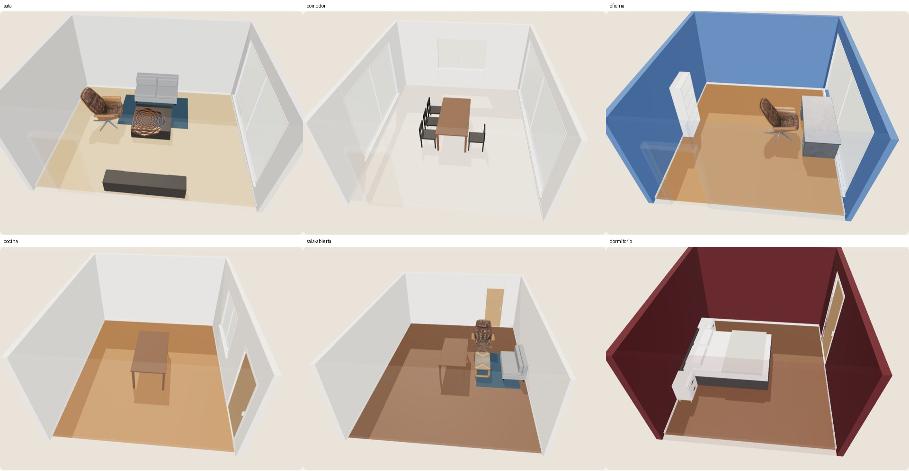

# Prueba de visión con fotos reales

Antes de construir el análisis de fotos sobre un modelo multimodal se midió, con poco gasto, si
ese modelo distingue un cuarto de otro. Seis fotos de Pexels (`e2e/fixtures/rooms/`, ver
`FUENTES.md`), una llamada por foto, con `services/ai/scripts/probe_vision.py`.

- **Proveedor:** Groq, capa gratuita (API compatible con OpenAI).
- **Modelo:** `qwen/qwen3.8-27b`. Es el único de la cuenta que acepta imágenes; el Llama 4 Scout
  que se esperaba usar ya no aparece en la lista de modelos.
- **Costo por foto:** ~2.850 tokens (2.379 de entrada con la imagen a 1024 px, ~450 de salida) y
  unos 2 s de respuesta.
- **Límites observados:** ~8.000 tokens por minuto (dos fotos por minuto) y 1.000 llamadas al día.
  La prueba completa gastó 6 llamadas útiles, 2 rechazadas por el límite por minuto y 1 para
  listar modelos.

## Qué entendió de cada foto

| Foto | Tipo | Medidas (m) | Aberturas | Muebles | Paredes / piso | Estilo |
|---|---|---|---|---|---|---|
| `cocina` | cocina | 4,5 × 5,5 × 2,7 | ventana y puerta a la derecha | isla, 2 taburetes, nevera, gabinetes en 3 paredes, planta | `#f0f0f0` / madera | clásico |
| `comedor` | comedor | 5,5 × 4,5 × 2,7 | ventanales a la derecha (90 %), al fondo y a la izquierda | mesa, 4 sillas, sofá, lámpara | `#f5f5f0` / madera clara | escandinavo |
| `dormitorio` | dormitorio | 3,5 × 4,5 × 2,5 | puerta a la derecha | cama, 2 mesitas, cuadro, lámpara | `#3d1c1c` / madera | moderno |
| `oficina` | oficina | 4,5 × 5,0 × 2,7 | ventanal a la derecha | escritorio, 3 sillas, 2 estanterías, mesa baja, planta, 3 cuadros, lámpara | `#4a6fa5` / madera | moderno |
| `sala-abierta` | sala | 5,5 × 7,5 × 2,7 | puerta al fondo, hacia la derecha | sofá, mesa de centro, alfombra, comedor con 4 sillas, cuadro, lámpara, planta | `#f0f0f0` / madera oscura | moderno |
| `sala` | sala | 5,5 × 4,5 × 2,7 | ventanal a la derecha | sofá, mueble de TV, TV, mesa de centro, alfombra, lámpara, cuadro | `#d3d3d3` / gris | moderno |

Las respuestas completas están en los `.json` de esta carpeta.

## Lectura (comparando a ojo con las fotos)

**Acierta y sirve para diferenciar cuartos**
- El tipo de cuarto, en las seis.
- En qué pared están puertas y ventanas: coincide con la foto en las seis (la puerta lateral del
  dormitorio, los tres ventanales del comedor, la puerta de entrada al fondo de la sala abierta).
- El inventario de muebles y junto a qué pared está cada uno.
- El color de las paredes: detecta la pared azul de la oficina y la vinotinto del dormitorio.

**Aproximado: el usuario debe confirmarlo**
- Las medidas son estimaciones redondeadas a medio metro. Sirven como proporción, no como dato.
- La altura sale casi siempre 2,7 m: es un valor típico, no una medición.
- La posición de las aberturas a lo largo de la pared es gruesa (casi siempre 0,5).

**No lo resuelve**
- La forma: respondió `rect` en las seis, incluida la sala abierta a la cocina. Con una sola foto
  no se ve la planta; las formas en L, T y U deben salir del asistente o de la corrección del
  usuario en el plano.
- Aberturas fuera de cuadro: en la sala abierta no vio la ventana lateral que apenas asoma.

## Consecuencias para el diseño

1. El modelo entrega **semántica** (tipo, pared de cada abertura, inventario, colores, estilo) y un
   constructor determinista arma el cuarto. No se le piden coordenadas.
2. La pantalla de confirmación pide **una medida ancla** y deja corregir forma y aberturas sobre el
   plano; la propuesta de la foto es el punto de partida, no el resultado final.
3. El inventario pasa al motor de distribución como muebles que deben estar, y los colores
   detectados a los acabados: con eso seis fotos dan seis cuartos claramente distintos aunque la
   planta sea rectangular.
4. Para cuidar la capa gratuita: una llamada por foto, caché por hash de la imagen, sin reintentos
   ante un 429 y respaldo al análisis local.

## Resultado en la app

Con `ROOM_ANALYZER=vision`, las mismas seis fotos se subieron como proyectos (dos por minuto, una
llamada por foto). Lo que quedó en cada proyecto:

| Foto | Cuarto (m) | Aberturas | Paredes / piso | Muebles colocados |
|---|---|---|---|---|
| `sala` | 5,5 × 4,5 × 2,7 | ventanal a la derecha | gris perla / roble | sofá, mesa de centro, mueble de TV, butaca, alfombra |
| `dormitorio` | 3,5 × 4,0 × 2,4 | puerta a la derecha | vino / nogal | cama y dos mesitas de noche |
| `comedor` | 5,0 × 6,0 × 2,8 | ventanales a la derecha, al fondo y a la izquierda | blanco / fresno | mesa de comedor y cuatro sillas |
| `oficina` | 4,5 × 5,0 × 2,7 | ventanal a la derecha | azul acero / teca | escritorio, librero y silla |
| `cocina` | 4,5 × 5,5 × 2,7 | puerta y ventana a la derecha | blanco / teca | solo una mesa |
| `sala-abierta` | 5,5 × 7,5 × 2,7 | puerta al fondo | blanco / nogal | sofá, mesa de centro, butaca, alfombra y mesa de comedor |

Capturas individuales en `capturas/`. Antes de este cambio las seis fotos daban la misma caja con
los mismos muebles.

**Lo que todavía no sale bien**
- **Cocina:** el modelo reconoce isla, taburetes, nevera y gabinetes, pero el motor de distribución
  no tiene roles para ellos ni existe el tipo de cuarto "cocina": queda casi vacía.
- **Sala abierta:** se coloca la mesa del comedor que vio el modelo, pero no sus sillas: "chair" en
  una sala se interpreta como butaca.
- **Repetir la misma foto puede dar medidas algo distintas** (el modelo no es determinista) y, con
  dos procesos del servicio, la caché y el tope diario se llevan por proceso.
- **Reacomodar** después usa la plantilla del tipo de cuarto: el inventario de la foto no se guarda.
- Si el modelo alcanza su límite por minuto, el proyecto se crea igual con el análisis local (así
  salió el dormitorio en el primer intento) y hay que volver a crearlo para usar la visión.

## Prompt usado

Está en `PROMPT`, dentro de `services/ai/scripts/probe_vision.py`. Pide un único objeto JSON con
`roomType`, `shape`, `widthM`, `depthM`, `heightM`, `openings`, `objects`, `palette`,
`floorMaterial`, `style`, `confidence` y `notes`, con las paredes nombradas respecto a la cámara
(`back` es la del fondo, `front` la que queda detrás).
